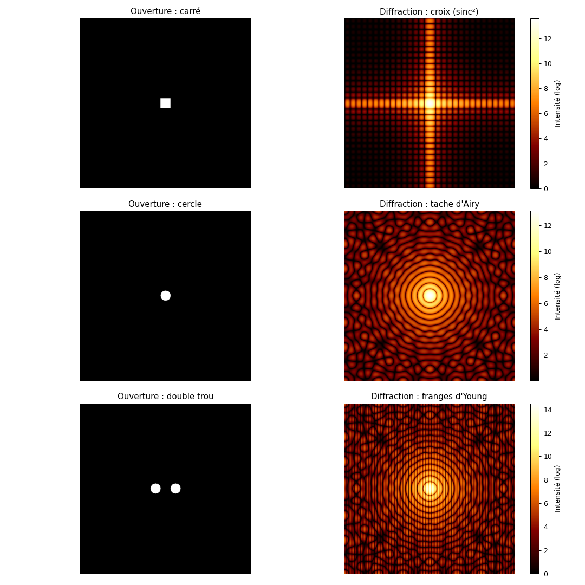
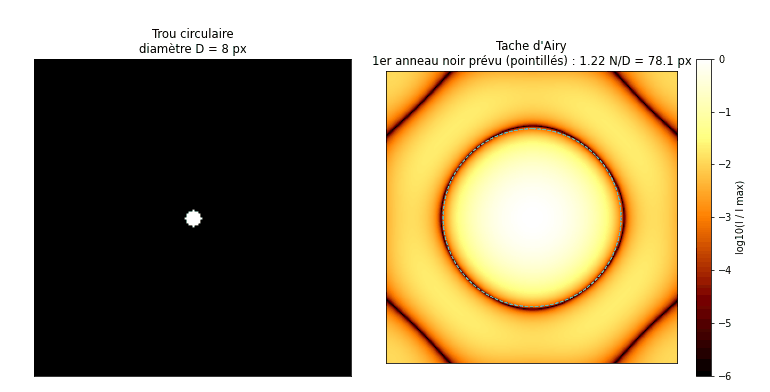

# Diffraction de Fraunhofer par FFT codée à la main

Simulation des figures de diffraction d'une onde plane par trois ouvertures (trou carré, trou circulaire, double trou d'Young), avec une **transformée de Fourier rapide implémentée from scratch** (algorithme de Cooley-Tukey), sans `numpy.fft`.



> **En bref**
> - La figure de diffraction en champ lointain est la transformée de Fourier de l'ouverture : tout le projet repose sur le calcul efficace de cette transformée.
> - FFT récursive écrite à la main (lemme de Danielson-Lanczos), étendue en 2D par séparabilité, sur une grille de 512 × 512 pixels.
> - Les trois figures attendues sont retrouvées : croix en sinus cardinal, tache d'Airy, franges d'Young.
> - Validation : écart de $10^{-15}$ avec `numpy.fft`, position des minima conforme à la théorie au pixel près.
> - Une animation fait varier la taille des trous et leur écart : la figure se resserre quand l'ouverture grandit, exactement comme le prévoit la théorie.

## Sommaire

1. [Objectif](#1-objectif)
2. [Physique de la diffraction de Fraunhofer](#2-physique-de-la-diffraction-de-fraunhofer)
3. [Du continu au discret](#3-du-continu-au-discret)
4. [La transformée de Fourier rapide](#4-la-transformée-de-fourier-rapide)
5. [Implémentation](#5-implémentation)
6. [Résultats et interprétation](#6-résultats-et-interprétation)
7. [Validation quantitative](#7-validation-quantitative)
8. [Limites et pistes](#8-limites-et-pistes)
9. [Lancer le code](#9-lancer-le-code)
10. [Références](#10-références)

---

## 1. Objectif

Simuler numériquement la diffraction d'une onde plane monochromatique par des ouvertures bidimensionnelles, et retrouver les figures classiques de l'optique ondulatoire. L'enjeu est double :

- **physique** : relier la forme de l'ouverture à la figure observée sur l'écran ;
- **numérique** : passer d'un formalisme continu (intégrale de Fourier) à un calcul discret efficace, en codant soi-même l'algorithme de FFT plutôt qu'en appelant une bibliothèque.

## 2. Physique de la diffraction de Fraunhofer

### Principe

Une onde plane éclaire un écran opaque percé d'une ouverture. On décrit l'ouverture par sa **fonction de transmission** $t(x, y)$, qui vaut 1 là où la lumière passe et 0 ailleurs. D'après le principe de Huygens-Fresnel, chaque point de l'ouverture réémet une onde sphérique, et le champ observé est la superposition de toutes ces ondes.

En **champ lointain** (régime de Fraunhofer : distance d'observation grande devant $a^2/\lambda$, où $a$ est la taille de l'ouverture), ou de façon équivalente dans le plan focal d'une lentille, les différences de marche deviennent linéaires en position et l'amplitude diffractée prend une forme remarquable :

$$A(f_x, f_y) \propto \iint t(x, y)\thinspace  e^{-2i\pi (f_x x + f_y y)}\thinspace  dx\thinspace  dy = \mathcal{F}\lbrace t \rbrace(f_x, f_y)$$

L'amplitude sur l'écran est la **transformée de Fourier** de l'ouverture, évaluée aux fréquences spatiales $f_x, f_y$ (proportionnelles à la position angulaire sur l'écran). Un détecteur ou l'œil mesure l'**intensité** :

$$I(f_x, f_y) = |A(f_x, f_y)|^2$$

### Figures attendues

| Ouverture | Transformée de Fourier | Figure observée |
|---|---|---|
| Carré de côté $a$ | $\mathrm{sinc}(\pi a f_x)\thinspace\mathrm{sinc}(\pi a f_y)$ | croix : produit de deux $\mathrm{sinc}^2$, zéros en $f = n/a$ |
| Cercle de diamètre $D$ | $2 J_1(u)/u$, avec $u = \pi D f$ ($J_1$ : fonction de Bessel) | tache d'Airy : disque central et anneaux, 1er anneau noir en $f = 1{,}22/D$ |
| Deux cercles séparés de $d$ | Airy $\times\ 2\cos(\pi d f_x)$ | anneaux d'Airy striés de franges d'interférence, interfrange $1/d$ |

Deux principes généraux se lisent dans ce tableau :

- **Relation d'échelle inverse** : plus l'ouverture est petite, plus la figure est étalée. Confiner la lumière dans l'espace élargit son spectre de fréquences spatiales, comme dans une relation d'incertitude.
- **Diffraction et interférences** : pour le double trou, la forme globale (l'enveloppe d'Airy) vient de la taille de chaque trou, et les franges viennent de la distance entre les trous.

## 3. Du continu au discret

### Échantillonnage

L'ordinateur ne manipule que des valeurs discrètes. L'ouverture est représentée par une image de $N \times N$ pixels ($N = 512$) : elle est échantillonnée. De manière générale, une fonction $f$ échantillonnée avec un pas $s$ est remplacée par la suite de ses valeurs $f_k = f(k s)$.

D'après le **théorème de Nyquist-Shannon**, un signal dont le spectre est limité à la fréquence $\nu_c = 1/(2s)$ est entièrement déterminé par ses échantillons. Les bords nets d'une ouverture contiennent en réalité des fréquences arbitrairement hautes : la discrétisation introduit donc un léger repliement de spectre (aliasing), visible sous forme de motifs fins dans les zones de faible intensité (voir partie 6).

### Transformée de Fourier discrète (DFT)

Sur $N$ points, la DFT remplace l'intégrale par une somme :

$$\hat f_n = \sum_{k=0}^{N-1} f_k\thinspace  e^{-2i\pi nk/N}, \qquad n = 0, \dots, N-1$$

La fréquence d'indice $n$ correspond à $n/N$ cycles par pixel. Deux conséquences pratiques :

- **Conversion théorie / pixels** : un zéro théorique en $f = 1/a$ (avec $a$ en pixels) se trouve à $n = N/a$ pixels du centre de la figure calculée.
- **Périodicité** : la DFT traite l'image comme si elle se répétait à l'infini. La fréquence nulle se retrouve dans le coin de l'image, d'où le recentrage par `fftshift` (partie 5).

### Coût du calcul direct

Chaque coefficient $\hat f_n$ demande une somme de $N$ termes : la DFT 1D coûte $O(N^2)$ opérations. En 2D, chacun des $N^2$ pixels de sortie est une somme sur les $N^2$ pixels d'entrée, soit $O(N^4)$ : pour $N = 512$, environ $7 \times 10^{10}$ multiplications complexes. C'est ce qui rend la FFT indispensable.

## 4. La transformée de Fourier rapide

### Lemme de Danielson-Lanczos

Pour $N$ pair, on sépare la somme en indices pairs ($k = 2j$) et impairs ($k = 2j + 1$) :

$$\hat f_n = \sum_{j=0}^{N/2-1} f_{2j}\thinspace  e^{-2i\pi nj/(N/2)} + e^{-2i\pi n/N} \sum_{j=0}^{N/2-1} f_{2j+1}\thinspace  e^{-2i\pi nj/(N/2)} = F_n^{(0)} + u^n F_n^{(1)}$$

où $F^{(0)}$ et $F^{(1)}$ sont les DFT de taille $N/2$ des sous-suites paire et impaire, et $u = e^{-2i\pi/N}$ est le **facteur de phase** (twiddle factor).

Comme $F^{(0)}$ et $F^{(1)}$ sont périodiques de période $N/2$ et que $u^{n+N/2} = -u^n$, on obtient les deux moitiés du résultat à partir des mêmes calculs (le « papillon ») :

$$\hat f_n = F_n^{(0)} + u^n F_n^{(1)}, \qquad \hat f_{n+N/2} = F_n^{(0)} - u^n F_n^{(1)}, \qquad 0 \le n < N/2$$

### Récursion et complexité

Si $N = 2^\ell$, on applique le lemme récursivement jusqu'à des sous-suites de taille 1, dont la transformée est la valeur elle-même. Il y a $\log_2 N$ niveaux, chacun demandant $O(N)$ opérations : la complexité passe de $O(N^2)$ à $O(N \log_2 N)$. C'est l'algorithme de **Cooley-Tukey** (1965), dont Danielson et Lanczos avaient publié l'idée dès 1942.

### Extension en 2D par séparabilité

L'exponentielle 2D se factorise : $e^{-2i\pi(nk + ml)/N} = e^{-2i\pi nk/N}\thinspace  e^{-2i\pi ml/N}$. La DFT 2D s'obtient donc en appliquant une FFT 1D sur chaque ligne, puis sur chaque colonne du résultat. Le coût total devient $O(N^2 \log N)$ : environ $2 \times 10^6$ papillons pour $N = 512$, contre $7 \times 10^{10}$ opérations en calcul direct.

## 5. Implémentation

### Fonctions

| Fonction | Rôle |
|---|---|
| `fft_1d(x)` | FFT récursive : séparation pair/impair, appels récursifs, combinaison par le papillon avec $u = e^{-2i\pi k/N}$ |
| `fft_2d(image)` | FFT sur chaque ligne, transposition, FFT sur chaque colonne, transposition inverse |
| `calcul_diffraction(image)` | FFT 2D de l'ouverture, recentrage par `np.fft.fftshift`, intensité $\lvert A \rvert^2$ |
| `animation_ouvertures()` | recalcule la figure pour des tailles d'ouverture et des écarts croissants, et superpose la prédiction théorique |

Seul `fftshift` est emprunté à NumPy : il ne fait que réordonner les indices pour placer la fréquence nulle au centre, sans aucun calcul de Fourier. Aucune normalisation n'est appliquée (certaines conventions divisent la DFT par $N$) : seule la forme de la figure est étudiée, pas son intensité absolue.

### Construction des ouvertures

Les ouvertures sont des tableaux de zéros (opaque) dans lesquels on met à 1 les pixels transparents :

- **carré** : par découpage d'indices (slicing) autour du centre ;
- **cercle** : par un masque booléen $(x - x_c)^2 + (y - y_c)^2 \le R^2$, construit avec `np.ogrid` ;
- **double trou** : deux masques circulaires décalés symétriquement du centre.

### Paramètres

| Paramètre | Valeur | Signification |
|---|---|---|
| `N` | 512 | taille de la grille ; puissance de 2 obligatoire pour la FFT récursive ($2^9$) |
| `demi` | 15 | demi-côté du carré, soit un côté $a = 30$ pixels |
| `rayon` | 15 | rayon du trou circulaire, soit un diamètre $D = 30$ pixels |
| `r_double` | 15 | rayon de chacun des deux trous |
| `ecart` | 30 | décalage de chaque trou par rapport au centre, soit une distance $d = 60$ pixels entre les trous |

La résolution $512 \times 512$ est un compromis entre la finesse des franges et le temps de calcul de la FFT en Python pur.

### Affichage

L'intensité est affichée en échelle logarithmique, $\log(I + 1)$ : les maxima secondaires sont de dizaines à des milliers de fois moins intenses que le pic central (le premier anneau d'Airy ne porte déjà que 1,75 % de l'intensité centrale) et seraient invisibles en échelle linéaire. Le $+1$ évite $\log(0)$. Le logarithme ne modifie pas le calcul physique, seulement la visualisation.

## 6. Résultats et interprétation

La figure en tête de page montre, pour chaque ouverture, le masque (à gauche) et l'intensité diffractée (à droite).

**Trou carré.** Pic central intense et lobes secondaires alignés sur les axes horizontal et vertical : c'est le produit $\mathrm{sinc}^2(\pi a f_x)\thinspace\mathrm{sinc}^2(\pi a f_y)$. La symétrie en croix reflète directement les bords rectilignes de l'ouverture.

**Trou circulaire.** Tache centrale brillante entourée d'anneaux concentriques d'intensité décroissante : la tache d'Airy. La régularité des anneaux montre que l'algorithme restitue bien la symétrie radiale, bien que le calcul se fasse sur une grille cartésienne.

**Double trou.** On retrouve l'enveloppe d'Airy d'un trou unique, striée de franges verticales alternativement sombres et brillantes : c'est le terme $\cos^2(\pi d f_x)$ des interférences d'Young. Les franges sont verticales parce que les deux trous sont alignés horizontalement.

**Motifs en « dentelle ».** Loin du centre, on distingue des motifs fins qui n'existent pas dans la théorie continue. Ils viennent de la discrétisation : bord pixelisé du cercle, taille finie de la grille et périodicité implicite de la DFT. L'échelle logarithmique, qui amplifie les faibles intensités, les rend visibles.

### Effet de la taille de l'ouverture



*Première partie : le diamètre du trou passe de 8 à 64 pixels ; le cercle en pointillés est le premier anneau noir prévu par la théorie, 1,22 N/D. Seconde partie : deux trous de rayon 8 pixels s'écartent de 30 à 120 pixels ; le titre indique l'interfrange prévu, N/d. L'intensité est normalisée par son maximum et affichée sur six ordres de grandeur.*

Cette animation illustre la **relation d'échelle inverse** de la partie 2 :

- quand le trou grandit, la tache d'Airy rétrécit, et son premier anneau noir reste exactement sur le cercle théorique, dont le rayon passe de 78 à 10 pixels ;
- quand les trous s'écartent, les franges d'Young se resserrent (interfrange de 17 à 4 pixels), tandis que l'enveloppe, fixée par la taille de chaque trou, ne change pas.

Chaque image demande une FFT complète en Python pur : l'animation (31 images) prend environ 3 minutes à générer.

## 7. Validation quantitative

| Test | Attendu | Obtenu |
|---|---|---|
| FFT maison vs `numpy.fft.fft2` (trou circulaire) | résultats identiques | écart relatif maximal ~ $10^{-15}$ (précision machine) |
| Carré, $a = 30$ px : 1er minimum sur l'axe | $N/a = 17{,}07$ px | 17 px |
| Cercle, $D = 30$ px : rayon du 1er anneau noir | $1{,}22\thinspace N/D \approx 20{,}8$ px | cohérent avec la figure |
| Double trou, $d = 60$ px : interfrange | $N/d \approx 8{,}5$ px | cohérent avec la figure |

Les deux premières vérifications sont recalculées et affichées à chaque exécution du script.

## 8. Limites et pistes

- **Temps de calcul** : la FFT récursive en Python pur prend environ 20 secondes pour les trois figures, contre quelques millisecondes pour `numpy.fft`, écrite en C. Une version itérative (sans récursion) et vectorisée réduirait fortement l'écart.
- **Taille imposée** : l'algorithme exige $N = 2^\ell$. Pour une taille quelconque, on peut compléter l'image par des zéros (zero padding) ou utiliser des variantes de la FFT (radix mixte, algorithme de Bluestein).
- **Unités physiques** : les résultats sont exprimés en pixels. Relier ces pixels à une longueur d'onde, une distance d'observation et une taille d'écran permettrait une comparaison directe avec une expérience.
- **Champ proche** : le régime de Fresnel (distance finie) se traite aussi par FFT, en multipliant le spectre par une fonction de transfert de propagation.

## 9. Lancer le code

```bash
pip install -r requirements.txt
python diffraction.py               # affiche les figures
python diffraction.py --animation   # anime l'effet de la taille des ouvertures (environ 3 min)
python diffraction.py --sauver      # enregistre la figure et l'animation dans figures/
```

## 10. Références

- J. W. Cooley et J. W. Tukey, *An algorithm for the machine calculation of complex Fourier series*, Mathematics of Computation 19, 297 (1965).
- G. C. Danielson et C. Lanczos, *Some improvements in practical Fourier analysis and their application to X-ray scattering from liquids*, Journal of the Franklin Institute 233, 365 (1942).
- W. H. Press et al., *Numerical Recipes*, chapitre sur la transformée de Fourier rapide, Cambridge University Press.
- E. Hecht, *Optique*, Pearson (chapitre sur la diffraction).
- M. Born et E. Wolf, *Principles of Optics*, Cambridge University Press.

---

Projet réalisé en M1 Physique à CY Cergy Paris Université (cours « Méthodes numériques pour les matériaux », janvier 2026).
